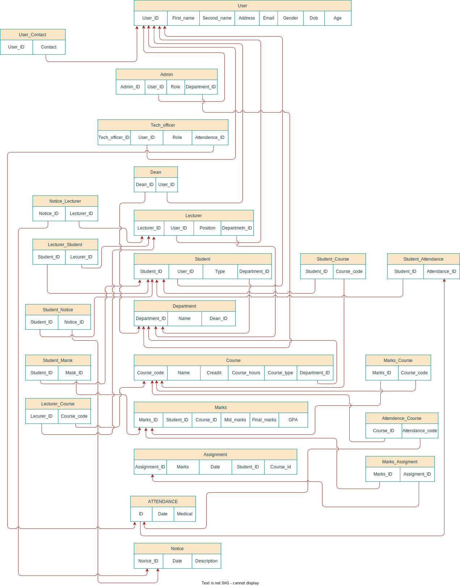
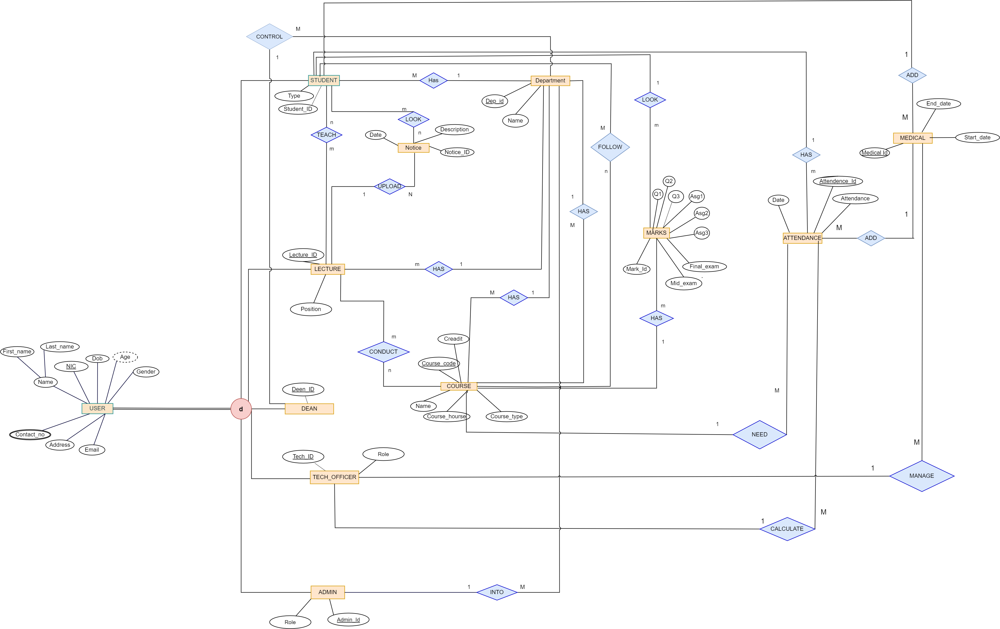
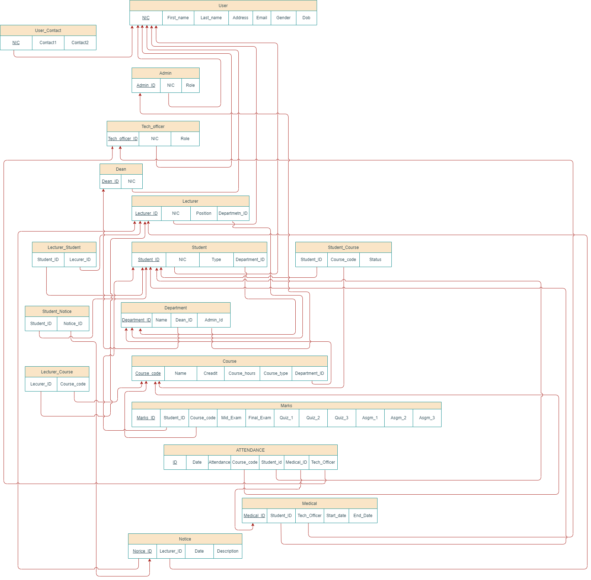

# TechnoMate
This repo is for TechnoMate which is interconnected LMS and MIS. Group project DBMS University of Ruhuna, FOT

# Group Project: Integrated LMS and MIS with DBMS

Welcome to our group project repository! We are building an integrated system that combines a Learning Management System (LMS) and a Management Information System (MIS), all powered by a robust Database Management System (DBMS).

## Table of Contents

- [Project Description](#project-description)
- [Features](#features)
- [Installation](#installation)
- [Usage](#usage)
- [Contributors](#contributors)
- [License](#license)

## Project Description

In this project, we are developing a comprehensive system that connects LMS and MIS to streamline educational and administrative processes. This integrated system aims to enhance educational institutions' efficiency by providing a centralized platform for managing courses, students, faculty, and administrative data.

## Features

- **Course Management:** Create, manage, and schedule courses efficiently.
- **User Roles:** Assign roles to users, such as students, faculty, and administrators.
- **Data Integration:** Seamlessly connect LMS and MIS to ensure data consistency.
- **Reporting:** Generate reports for administrative and academic purposes.
- **Authentication and Authorization:** Ensure secure access control to different system modules.

## ER diagram


## Relational Mapping



## After completing the Database,
- **ER Diagram**


- **Relational Mapping**


1. Clone the repository:

   ```bash
   git clone https://github.com/your-surajnaveen/technomate
